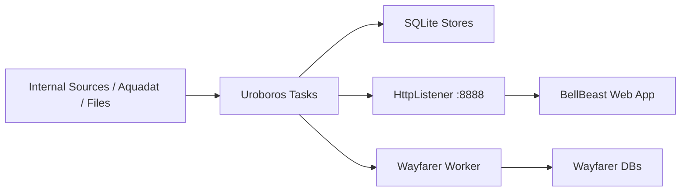
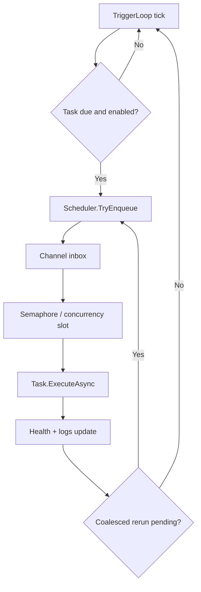
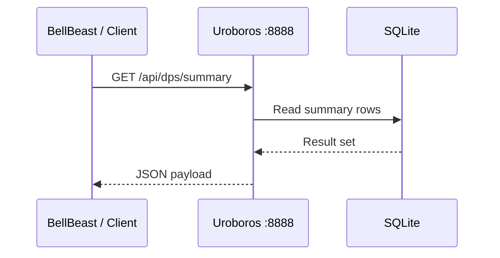

# 01 Uroboros Architecture

## Project Overview

### Confirmed by code
- Uroboros is a Windows-targeted .NET executable project (`net10.0-windows`, `win-x64`) that combines task scheduling, HTTP control/data endpoints, SQLite-backed storage/configuration, Aquadat processing, lab import, summary APIs, and optional Wayfarer orchestration.
- Main entrypoint is `Program.Main()` in `C:\Users\peera\OneDrive\Desktop\Uroboros\Uroboros\Uroboros\Program.cs`.

### Build result
- `dotnet build` succeeded with 0 warnings and 0 errors.

## Actual Project Structure

- `Program.cs`: scheduler, task registration, HTTP listener, main bootstrap.
- `AdminConfig.cs`: SQLite-backed runtime task settings and force-run updates.
- `TriggerLoopcs.cs`: periodic trigger loop and next-run handling.
- `AquadatFast.cs`: Aquadat query, export, DB write, and latest-view logic.
- `AquadatRemarkHelper.cs`: remark/event-related Aquadat helper with bearer-auth HTTP calls.
- `HtmlHookModule.cs`, `PTC.cs`: source-specific collection/storage logic.
- `DpsHandlers.cs`, `TpsHandlers.cs`, `RwsHandlers.cs`, `ChemHandlers.cs`, `EVENTHandlers.cs`, `ClDetectorHandlers.cs`, `LabSummaryModule.cs`: HTTP summary/report handlers.
- `DailyLabImporter.cs`: spreadsheet-driven lab import into SQLite.
- `GoogleDrive.cs`: upload/download/clone helpers using Google Drive API.
- `WayfarerIntegration.cs`: process launch, SQLite query/export, HTTP handlers for Wayfarer-linked data.
- `appsettings.json`: Wayfarer integration settings.

## Entry Point Analysis

### Confirmed by code
- `Program.Main()` creates `EngineContext`, `StageGate`, `TaskHealthTracker`, `NextRunTracker`, and `WayfarerIntegration`.
- It registers tasks including:
  `tps.refresh`, `dps.refresh`, `rws1.refresh`, `rws2.refresh`, `chem1.refresh`, `chem2.refresh`, `branch.refresh`, `rcv38.refresh`, `ptc.query.once`, `onlinelab.query`, `Aquadat.refresh`, `AquadatFWS.refresh`, `DB_upload.refresh`, `DB_download.refresh`, `MDB_upload.refresh`, `MDB_download.refresh`, `LAB.import.daily`, `wayfarer.pm.collect`.
- It initializes `engine_admin.db` through `SqliteTaskSettingsStore`, starts:
  `Scheduler.RunLoopAsync`,
  `WebListener.RunAsync`,
  `TriggerLoop.RunAsync`.

## Scheduler / Task System

### Confirmed by code
- `Scheduler` uses an unbounded `Channel<IEngineTask>`, `SemaphoreSlim` concurrency control, per-task run policies, optional timeout cancellation, health tracking, and coalescing behavior.
- `TriggerLoop` runs every 250 ms and computes due work from interval configuration stored in SQLite.
- Runtime task enable/disable, interval changes, timeout overrides, and force-run stamps are managed by `TaskConfigService` + `SqliteTaskSettingsStore`.
- `StageGate` supports global pause/resume.

### Recommended interpretation
- Uroboros functions as a local automation engine with a lightweight control plane stored in SQLite rather than a separate orchestration service.

## HTTP Listener / API Routes

### Confirmed by code
- Listener is `HttpListener`-based, not ASP.NET Core.
- Default prefix is `http://+:8888/`, overridable by environment variable `UROBOROS_HTTP_PREFIX`.
- Confirmed routes in `Program.cs` include:

| Route | Method | Purpose |
| --- | --- | --- |
| `/admin/tasks/status` | GET | Running task and health status |
| `/admin/tasks/config` | GET/POST | Read/update runtime config |
| `/admin/pause` | POST | Pause scheduler gate |
| `/admin/resume` | POST | Resume scheduler gate |
| `/admin/cancelall` | POST | Cancel running tasks |
| `/admin/tasks/forcerun` | POST | Force due timestamps into task config |
| `/tasks/enqueue` | POST | Manual enqueue by task name |
| `/api/verify` | POST | Aquadat verification |
| `/api/process` | POST | Aquadat processing/export |
| `/api/lookup/products` | GET | Lookup service |
| `/api/lookup/companies` | GET | Lookup service |
| `/api/chem_report` | POST | CHEM report query |
| `/api/chem_report/export` | POST | CHEM report export |
| `/api/ptc/keys` | GET | PTC key list |
| `/api/ptc/series` | GET | PTC series query |
| `/api/online_lab` | OPTIONS/POST | Online lab ingest/query surface |
| `/api/dps/summary` | OPTIONS/GET | DPS summary |
| `/api/tps/summary` | OPTIONS/GET | TPS summary |
| `/api/rws/summary` | OPTIONS/GET | RWS summary |
| `/api/chem/summary` | OPTIONS/GET | CHEM summary |
| `/api/event/summary` | OPTIONS/GET | Event summary |
| `/api/cldetector/summary` | GET | Chlorine detector summary |
| `/api/lab/summary` | POST | Lab summary |

### Not confirmed from code
- A full OpenAPI/Swagger contract.

## Database / Storage Usage

### Confirmed by code
- `engine_admin.db`: task runtime settings in `task_settings`.
- `data.db`: core SQLite store used by multiple handlers and PTC provider.
- `media\chem.db`: CHEM/Event data source usage is explicitly referenced.
- `aqtable.db`: Aquadat metadata lookup source in Aquadat processing.
- `DailyLabImporter.cs` writes imported lab rows into SQLite.
- Many summary handlers open SQLite in read-only mode with shared cache.
- `AquadatFast.cs` writes to `AQ_readings_narrow_v2`, `AQ_readings_FWS_v2`, and creates `v_aq_latest` / `v_aq_latest_raw`.

## External Process / Service Integration

### Confirmed by code
- HTTP data pulls from multiple internal endpoints such as `allch.cgi` sources in refresh tasks.
- Aquadat calls are implemented against `http://aquadat.mwa.co.th:12007/api/aquaDATService/...`.
- Google Drive API integration is implemented via `Google.Apis.Drive.v3`.
- Wayfarer process launching is implemented in `WayfarerIntegration.RunCollectorAsync()`.
- Port-conflict diagnostics invoke `netsh http show servicestate`.

## Wayfarer Integration

### Confirmed by code
- Uroboros loads `Wayfarer` config from `appsettings.json`.
- It registers scheduler task `wayfarer.pm.collect`.
- It can execute the Wayfarer worker using `dotnet <dll>` or `dotnet run --project ... --no-build`, depending on resolved artifacts.
- It opens read-only connections to Wayfarer main and meta SQLite databases.
- It exposes list/detail/filter/export logic over Wayfarer-collected work orders.

## Config Files and Important Settings

### Confirmed by code
- `appsettings.json` contains Wayfarer project path, working directory, timeout, main DB path, and meta DB path.
- Default HTTP listener prefix is `http://+:8888/`.
- Runtime task configuration is not static-only; it is persisted in `engine_admin.db`.

## Error and Log Handling

### Confirmed by code
- Logging abstraction is minimal `ConsoleLogger`, but task lifecycle logging is extensive.
- Scheduler records start, success, cancel, and failure states.
- WebListener wraps handler errors and returns JSON `500`.
- Trigger loop and SQLite code include timeout/busy/lock handling patterns.
- Port conflict diagnostics provide additional listener/process context.

## Mermaid Diagrams

## Evidence Table

| File path | Evidence |
| --- | --- |
| `C:\Users\peera\OneDrive\Desktop\Uroboros\Uroboros\Uroboros\Program.cs` | Main bootstrap, scheduler, task registration, HTTP listener, routes, port `8888` |
| `C:\Users\peera\OneDrive\Desktop\Uroboros\Uroboros\Uroboros\TriggerLoopcs.cs` | Periodic due-check loop and keep-phase scheduling |
| `C:\Users\peera\OneDrive\Desktop\Uroboros\Uroboros\Uroboros\AdminConfig.cs` | SQLite-backed task settings, force-run, enable/interval update logic |
| `C:\Users\peera\OneDrive\Desktop\Uroboros\Uroboros\Uroboros\AquadatFast.cs` | Aquadat auth/fetch/export/write pipeline and latest-view creation |
| `C:\Users\peera\OneDrive\Desktop\Uroboros\Uroboros\Uroboros\AquadatRemarkHelper.cs` | Bearer-auth remark helper and SQLite interactions |
| `C:\Users\peera\OneDrive\Desktop\Uroboros\Uroboros\Uroboros\DailyLabImporter.cs` | Lab Excel import into SQLite |
| `C:\Users\peera\OneDrive\Desktop\Uroboros\Uroboros\Uroboros\GoogleDrive.cs` | External Google Drive file movement/clone integration |
| `C:\Users\peera\OneDrive\Desktop\Uroboros\Uroboros\Uroboros\WayfarerIntegration.cs` | Wayfarer process control, DB query, filters, export |
| `C:\Users\peera\OneDrive\Desktop\Uroboros\Uroboros\Uroboros\appsettings.json` | Wayfarer integration settings |
| `C:\Users\peera\OneDrive\Desktop\Uroboros\Uroboros\Uroboros\DpsHandlers.cs` | DPS summary route implementation against SQLite |
| `C:\Users\peera\OneDrive\Desktop\Uroboros\Uroboros\Uroboros\TpsHandlers.cs` | TPS summary route implementation |
| `C:\Users\peera\OneDrive\Desktop\Uroboros\Uroboros\Uroboros\RwsHandlers.cs` | RWS summary route implementation |
| `C:\Users\peera\OneDrive\Desktop\Uroboros\Uroboros\Uroboros\ChemHandlers.cs` | CHEM summary route implementation |
| `C:\Users\peera\OneDrive\Desktop\Uroboros\Uroboros\Uroboros\EVENTHandlers.cs` | Event summary route implementation |

