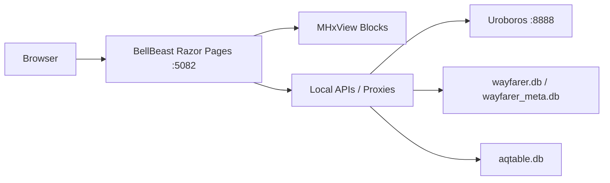
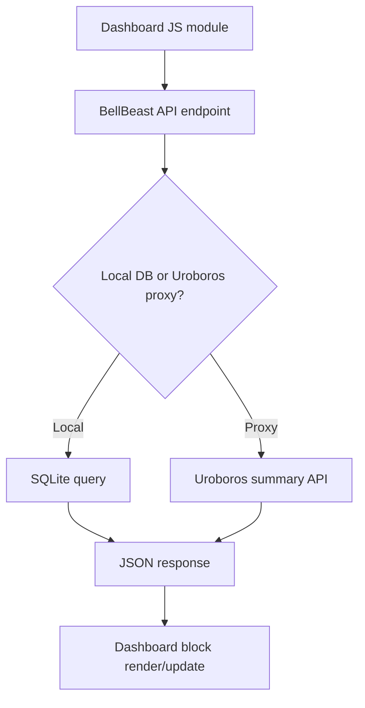
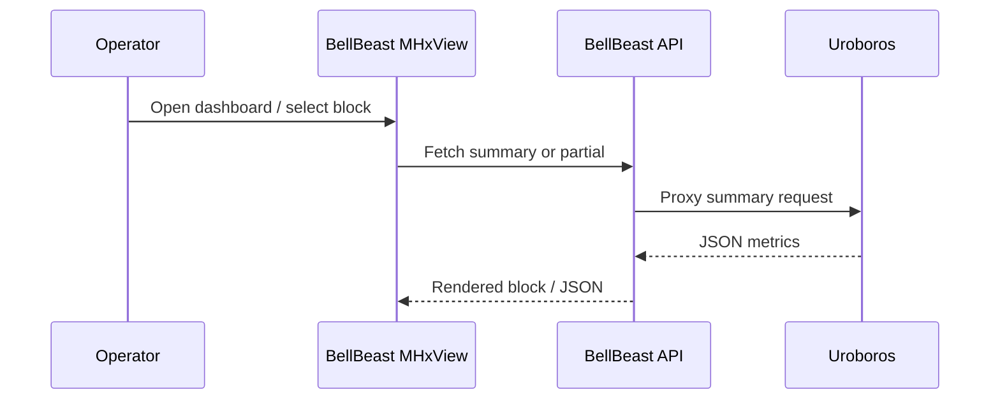

# 02 BellBeast Architecture

## Project Overview

### Confirmed by code
- BellBeast is an ASP.NET Core Razor Pages web application (`net9.0`) listening on port `5082`.
- It provides MHxView dashboard pages, login/admin surfaces, local SQLite-backed APIs, proxy APIs to Uroboros, and local Wayfarer browsing/export APIs.

### Build result
- `dotnet build` succeeded with 2 warnings and 0 errors.
- Warnings:
  - Possible null dereference in `Program.cs`.
  - `IHtmlHelper.Partial` synchronous partial warning in `Pages/MHxViewer/MHxView.cshtml`.

## Actual Project Structure

- `Program.cs`: app bootstrap, auth, port, proxy APIs, local APIs.
- `Pages/`: Razor Pages.
- `Pages/MHxViewer/`: MHxView page and block partials.
- `wwwroot/js`: dashboard-specific JavaScript modules.
- `wwwroot/css`: site and Wayfarer styling.
- `Services/EngineAdminService.cs`: HTTP client for Uroboros admin control.
- `Wayfarer/`: local Wayfarer SQLite query/export services and DTOs.
- `App_Data/`: `aqtable.db`, `wayfarer.db`, `wayfarer_meta.db`, `backend-config.json`.

## Razor Pages Structure

### Confirmed by code
- Main pages include:
  `Index`, `Login`, `Privacy`, `MH_report`, `CHEM_report`, `WebPM`, `Error`.
- Admin pages:
  `Pages/Admin/Login`, `Pages/Admin/AdminPage`.
- MHxView pages:
  `Pages/MHxViewer/MHxView.cshtml`,
  `_BlockTPS`, `_BlockDPS`, `_BlockRPS`, `_BlockCHEM`, `_BlockLAB`, `_BlockEvent`, `_BlockCLdetector`, `_BlockPTC_oneshot`, `_BlockCwsFws1`, `_BlockCwsFws2`, `_SlotRenderer`.

## MHxView Dashboard Structure

### Confirmed by code
- `MHxView.cshtml` declares default slot layout:
  `TPS`, `DPS`, `RPS`, `CHEM`, `EVENT`, `LAB`, `CLDETECTOR`, `PTC`.
- The page supports dynamic slot reconfiguration using browser `localStorage`.
- `OnGetSlot` in `MHxView.cshtml.cs` whitelists block keys and returns partial HTML.
- `OnGetSmartmap` acts as a server-side SmartMap proxy.

### Dashboard blocks/modules confirmed by code
- `RPS`
- `DPS`
- `TPS`
- `CHEM`
- `LAB`
- `PTC`
- `EVENT`
- `CL Detector`
- `CWS/FWS` partials are present as `_BlockCwsFws1` and `_BlockCwsFws2`

## JS/CSS Assets and Roles

### Confirmed by code
- `BBTrend.js`: chart/trend initialization.
- `DPSview.js`, `dps_summary.js`, `dps_smartmap_overlay.js`: DPS rendering and overlay logic.
- `RWSview.js`, `RWS_online_settings.js`, `RWS_summary.js`: RWS rendering/settings/summary.
- `TPS_settings.js`, `TPS_summary.js`: TPS settings/summary.
- `CHEMview.js`, `CHEM_summary.js`, `CHEM_settings.js`: CHEM display/summary/settings.
- `EVENTview.js`, `EVENT_settings.js`: event display/settings.
- `LABview.js`: LAB block behavior.
- `PTCview.js`, `ptc_smartmap_overlay.js`: PTC block behavior.
- `CLDetectorView.js`, `CLDetectorSettings.js`: chlorine detector UI.
- `wayfarer.js`, `wayfarer.css`, `wayfarer-filter-tabs-v2.css`: Wayfarer-oriented front-end assets.

## API / Proxy / Backend Communication

### Confirmed by code
- Port `5082` is configured in `appsettings.json` and `launchSettings.json`.
- `backend-config.json` points BellBeast to `http://localhost:8888`.
- BellBeast proxies Uroboros APIs for process, reports, summaries, and admin commands.
- `EngineAdminService` directly targets `http://localhost:8888/` for pause/resume/cancel/enqueue.
- BellBeast also exposes local SQLite-backed APIs:
  `/api/stations`, `/api/aqtable`, `/api/wayfarer/*`, `/api/wayfarer/map-summary`, `/api/wayfarer/map-branch-workorders`, `/api/smartmap`.

## WebPM / Wayfarer UI Integration

### Confirmed by code
- `Pages/WebPM.cshtml(.cs)` exists.
- `Program.cs` exposes `/api/wayfarer/{**path}` proxy and dedicated map summary endpoints.
- `WayfarerMapQueryService` reads branch-level summaries and work orders from `wayfarer.db`.
- `WayfarerApiExtensions.cs` implements local `/api/wayfarer` health/filter/list/detail/export endpoints against SQLite.

## Config / Database Usage

### Confirmed by code
- `appsettings.json`:
  - Kestrel HTTP endpoint `http://*:5082`
  - `AqTable:DbPath = App_Data/aqtable.db`
  - `Wayfarer:DbPath = App_Data/wayfarer.db`
  - `Wayfarer:MetaDbPath = App_Data/wayfarer_meta.db`
  - admin auth values present; sensitive values must be masked in reporting
- `backend-config.json` defines the Uroboros backend base URL and path mapping.

## Logging / Error Handling / Security

### Confirmed by code
- Production exception handler uses `/Error`; HSTS enabled outside development.
- Two cookie schemes exist: user cookie and admin cookie.
- API auth redirects are converted to `401`/`403` for `/api/*`.
- User login stores Aquadat token as a claim.
- Admin login uses configured username plus SHA-256 password verification.

### Important limitation confirmed by code
- `Pages/Login.cshtml.cs` includes a brute-force password-rotation fallback against Aquadat. This is operationally explicit in code but should be presented as a risk, not as a best practice.

## Mermaid Diagrams

## Evidence Table

| File path | Evidence |
| --- | --- |
| `C:\Users\peera\OneDrive\Desktop\BellBeast\BellBeast\BellBeast\Program.cs` | Port `5082`, auth, proxy endpoints, local API surfaces, Uroboros integration |
| `C:\Users\peera\OneDrive\Desktop\BellBeast\BellBeast\BellBeast\appsettings.json` | Kestrel endpoint and local DB paths |
| `C:\Users\peera\OneDrive\Desktop\BellBeast\BellBeast\BellBeast\Properties\launchSettings.json` | Development URLs and runtime ports |
| `C:\Users\peera\OneDrive\Desktop\BellBeast\BellBeast\BellBeast\App_Data\backend-config.json` | Backend base URL `localhost:8888` and path mapping |
| `C:\Users\peera\OneDrive\Desktop\BellBeast\BellBeast\BellBeast\Pages\MHxViewer\MHxView.cshtml` | Slot-based dashboard structure and JS asset loading |
| `C:\Users\peera\OneDrive\Desktop\BellBeast\BellBeast\BellBeast\Pages\MHxViewer\MHxView.cshtml.cs` | Partial-slot rendering and SmartMap proxy |
| `C:\Users\peera\OneDrive\Desktop\BellBeast\BellBeast\BellBeast\Services\EngineAdminService.cs` | BellBeast-to-Uroboros admin control client |
| `C:\Users\peera\OneDrive\Desktop\BellBeast\BellBeast\BellBeast\Pages\Login.cshtml.cs` | Aquadat token login flow and fallback rotation logic |
| `C:\Users\peera\OneDrive\Desktop\BellBeast\BellBeast\BellBeast\Pages\Admin\Login.cshtml.cs` | Admin authentication with hashed password verification |
| `C:\Users\peera\OneDrive\Desktop\BellBeast\BellBeast\BellBeast\Wayfarer\WayfarerApiExtensions.cs` | Local Wayfarer filter/list/detail/export APIs |
| `C:\Users\peera\OneDrive\Desktop\BellBeast\BellBeast\BellBeast\Wayfarer\WayfarerMapQueryService.cs` | Branch and status-group analysis queries over Wayfarer SQLite data |
| `C:\Users\peera\OneDrive\Desktop\BellBeast\BellBeast\BellBeast\wwwroot\js\DPSview.js` | DPS dashboard behavior |
| `C:\Users\peera\OneDrive\Desktop\BellBeast\BellBeast\BellBeast\wwwroot\js\CHEMview.js` | CHEM dashboard behavior |
| `C:\Users\peera\OneDrive\Desktop\BellBeast\BellBeast\BellBeast\wwwroot\js\EVENTview.js` | Event dashboard behavior |
| `C:\Users\peera\OneDrive\Desktop\BellBeast\BellBeast\BellBeast\wwwroot\js\wayfarer.js` | Wayfarer front-end support asset |

