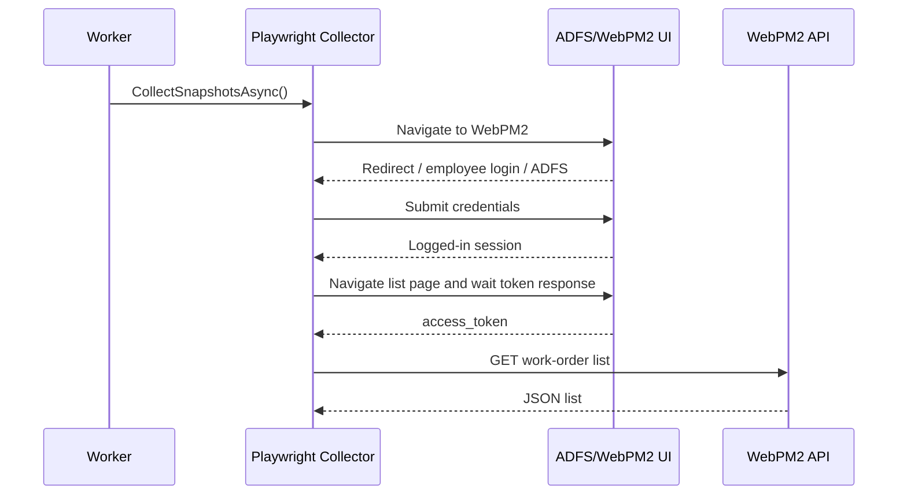
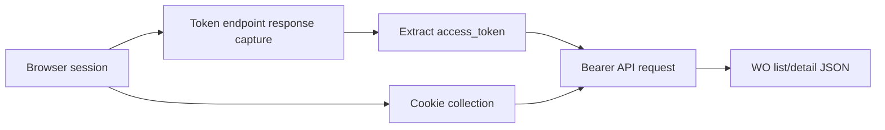
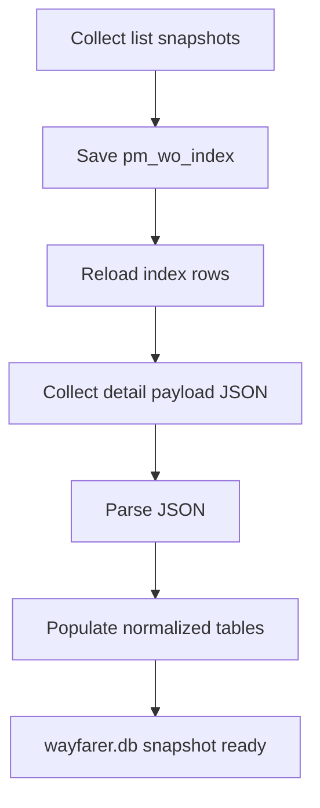

# 03 Wayfarer Architecture

## Project Overview

### Confirmed by code
- Wayfarer consists of three projects:
  - `Wayfarer.Core`
  - `Wayfarer.Playwright`
  - `Wayfarer.Worker`
- It implements a one-shot collector workflow:
  Playwright login/session -> token capture -> WebPM2 list API fetch -> local SQLite snapshot save -> detail API fetch -> local SQLite detail save.

### Current maturity
- Confirmed by code: more than scaffold, less than a general platform service.
- Recommended label: `collector/foundation` or `implemented collector`.
- Reason: login automation, token capture, API fetch, and storage are implemented; however, it is still a one-shot worker with local config and local SQLite persistence.

### Build result
- `dotnet build` succeeded with 0 warnings and 0 errors.

## Project Structure

- `Wayfarer.Core`
  - `Interfaces/IPmCollector.cs`
  - `Models/PmWoRecord.cs`
  - `Models/PmWoDetailEnvelope.cs`
- `Wayfarer.Playwright`
  - `Options/PmSiteOptions.cs`
  - `Services/PlaywrightPmCollector.cs`
  - `appsettings.json`
- `Wayfarer.Worker`
  - `Program.cs`
  - `Worker.cs`
  - `Config/SqlitePmSnapshotStore.cs`
  - `appsettings.json`
  - `appsettings.Development.json`

## Worker Execution Flow

### Confirmed by code
- `Host.CreateApplicationBuilder(args)` configures `PmSiteOptions`, registers `PlaywrightPmCollector` as `IPmCollector`, registers `SqlitePmSnapshotStore`, and runs hosted service `Worker`.
- `Worker.ExecuteAsync()`:
  1. logs start
  2. collects snapshot records
  3. stores snapshot index rows
  4. reloads index rows
  5. collects detail payloads
  6. stores detail payloads
  7. logs finish
  8. stops host explicitly so the process exits

## Playwright Automation Flow

### Confirmed by code
- `PlaywrightPmCollector` launches Chromium with configurable `Headless`.
- It opens a browser context and page, navigates to WebPM2, handles employee-login selection if needed, waits for ADFS redirect, and submits credentials.
- After login, it navigates to list/detail pages and intercepts the token response from `/sso/realms/webpm/protocol/openid-connect/token`.

## Login / ADFS Flow

### Confirmed by code
- The collector distinguishes:
  - direct ADFS page already loaded
  - WebPM page that still needs employee-login click
- It fills username/password fields using several selectors and submits the form.
- It retries using rotated numeric password candidates derived from the configured password.

### Security-sensitive handling
- Confirmed by code: when a rotated candidate works, the collector writes that working password back into `appsettings.json`.
- This behavior is implemented and should be described as operationally convenient but security-sensitive.

## Token Capture Flow

### Confirmed by code
- `NavigateAndCaptureAccessTokenAsync()` uses `RunAndWaitForResponseAsync()` and waits for a `POST` to the token endpoint path.
- It deserializes the returned JSON and extracts `access_token`.
- `BuildCookieHeaderAsync()` collects browser cookies for `webpm2.mwa.co.th` and `madfed.mwa.co.th`.
- API calls are then made with `Authorization: Bearer <token>` plus `Cookie` header.

## Work Order List Collection Flow

### Confirmed by code
- List API base is `https://webpm2.mwa.co.th/api/api/wo`.
- The list query is built with:
  `pageSize=1000`, `offset`, `orderBy=wodate`, `orderDirection=desc`, `myOrder=true`, `siteNo=[103]`.
- Collection stops when:
  - payload has no data
  - offset reaches total
  - work order date is older than 365-day lookback cutoff
- Output is normalized into `PmWoRecord`.

## Work Order Detail Collection Flow

### Confirmed by code
- For each stored snapshot row, Wayfarer builds or uses a detail URL.
- It re-navigates to the detail page, captures a fresh token if needed, and calls `GET https://webpm2.mwa.co.th/api/api/wo/{woNo}`.
- Raw JSON is preserved inside `PmWoDetailEnvelope`.

## Snapshot / Database Storage Flow

### Confirmed by code
- SQLite database path is `AppContext.BaseDirectory\\wayfarer.db`.
- Connection is opened `ReadWriteCreate` with shared cache.
- Connection pragmas:
  `journal_mode=WAL`, `synchronous=NORMAL`, `busy_timeout=5000`, `foreign_keys=ON`.
- Snapshot save clears prior child/detail tables and parent index rows before inserting fresh data.
- Detail save parses JSON and populates normalized tables:
  `pm_wo_overview`,
  `pm_wo_schedule_status`,
  `pm_wo_people_departments`,
  `pm_wo_damage_failure`,
  `pm_wo_history`,
  `pm_wo_task`,
  `pm_wo_actual_manhrs`,
  `pm_wo_meta_flags`,
  `pm_wo_flowtype`.

### Recommended interpretation
- The schema acts as an analytical snapshot database, not merely a raw cache, because it preserves fields useful for downstream filtering, duration analysis, and export.

## DTO / Model Structure

### Confirmed by code
- `PmWoRecord` stores overview list fields:
  `WoNo`, `DetailUrl`, `WoCode`, `WoDate`, `WoProblem`, `WoStatusNo`, `WoStatusCode`, `WoTypeCode`, `EqNo`, `PuNo`, `DeptCode`, `FetchedAtUtc`.
- `PmWoDetailEnvelope` stores:
  `WoNo`, `DetailUrl`, raw `Json`, `FetchedAtUtc`.

## Config and appsettings Usage

### Confirmed by code
- `Wayfarer.Worker/appsettings.json` contains `PmSite` section with BaseUrl/LoginUrl/Username/Password/Headless.
- `Wayfarer.Playwright/appsettings.json` also contains a `PmSite` section, but the worker is the actual host reading options at runtime.
- `Wayfarer.Worker.csproj` includes `UserSecretsId`, but no secrets retrieval logic was confirmed in the inspected code.

## Error and Log Handling

### Confirmed by code
- Worker logs start and finish.
- Playwright collector logs navigation, login attempts, token acquisition, API URLs, and collection counts.
- `NetworkIdle` timeouts are downgraded to warnings when DOM content is already available.
- Failures on login, token extraction, or HTTP status codes throw exceptions.

## Mermaid Diagrams

## Evidence Table

| File path | Evidence |
| --- | --- |
| `C:\Users\peera\OneDrive\Desktop\Wayfarer\Wayfarer\Wayfarer.Worker\Program.cs` | Host bootstrap and DI wiring |
| `C:\Users\peera\OneDrive\Desktop\Wayfarer\Wayfarer\Wayfarer.Worker\Worker.cs` | One-shot collection execution order |
| `C:\Users\peera\OneDrive\Desktop\Wayfarer\Wayfarer\Wayfarer.Playwright\Services\PlaywrightPmCollector.cs` | Playwright automation, ADFS flow, token capture, API calls |
| `C:\Users\peera\OneDrive\Desktop\Wayfarer\Wayfarer\Wayfarer.Worker\Config\SqlitePmSnapshotStore.cs` | SQLite schema creation and snapshot persistence |
| `C:\Users\peera\OneDrive\Desktop\Wayfarer\Wayfarer\Wayfarer.Worker\appsettings.json` | Runtime `PmSite` configuration |
| `C:\Users\peera\OneDrive\Desktop\Wayfarer\Wayfarer\Wayfarer.Playwright\Options\PmSiteOptions.cs` | Option contract for login/headless settings |
| `C:\Users\peera\OneDrive\Desktop\Wayfarer\Wayfarer\Wayfarer.Core\Interfaces\IPmCollector.cs` | Collector abstraction |
| `C:\Users\peera\OneDrive\Desktop\Wayfarer\Wayfarer\Wayfarer.Core\Models\PmWoRecord.cs` | List-snapshot DTO |
| `C:\Users\peera\OneDrive\Desktop\Wayfarer\Wayfarer\Wayfarer.Core\Models\PmWoDetailEnvelope.cs` | Detail-payload DTO |

