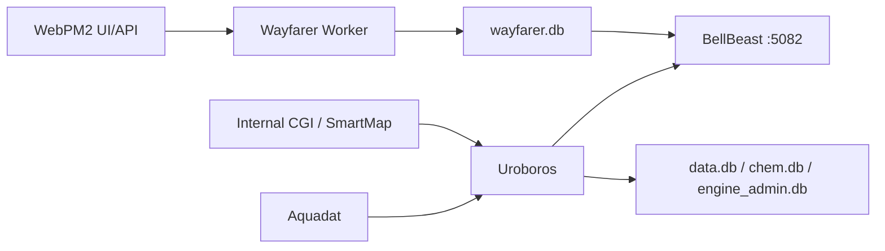
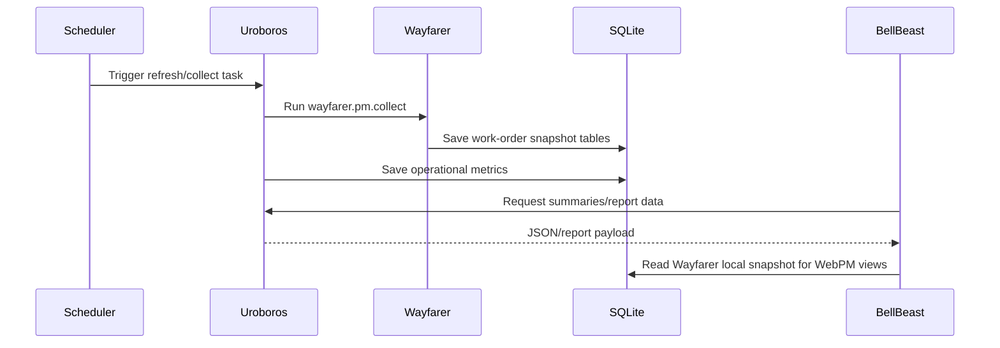
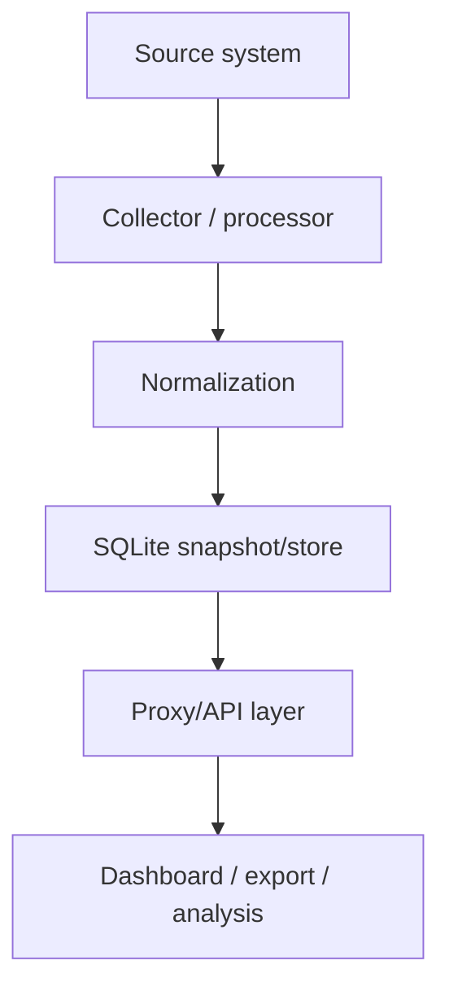

# 04 Cross-System Integration

## Uroboros <-> BellBeast

### Confirmed by code
- BellBeast `App_Data/backend-config.json` points to `http://localhost:8888`.
- BellBeast proxies multiple report/summary endpoints to Uroboros.
- BellBeast admin commands call Uroboros admin/task routes either directly through `EngineAdminService` or proxy endpoints in `Program.cs`.

## Uroboros <-> Wayfarer

### Confirmed by code
- Uroboros reads Wayfarer settings from `appsettings.json`.
- Uroboros registers and schedules `wayfarer.pm.collect`.
- Uroboros can execute the Wayfarer worker process and later read `wayfarer.db` plus `wayfarer_meta.db`.
- Uroboros contains Wayfarer list/filter/detail/export logic in `WayfarerIntegration.cs`.

## BellBeast <-> Wayfarer

### Confirmed by code
- BellBeast reads local `App_Data/wayfarer.db` and `App_Data/wayfarer_meta.db`.
- BellBeast exposes `/api/wayfarer` and branch-map endpoints for downstream UI use.
- BellBeast ships dedicated Wayfarer CSS/JS assets and a `WebPM` page.

## External Systems

### Aquadat
- Confirmed by code in Uroboros and BellBeast login:
  `http://aquadat.mwa.co.th:12007/api/aquaDATService/Enroll`
  and Aquadat data endpoints.

### WebPM2
- Confirmed by code in Wayfarer:
  browser pages under `https://webpm2.mwa.co.th/app`
  and API under `https://webpm2.mwa.co.th/api/api/wo`.

### Internal web services
- Confirmed by code:
  internal `allch.cgi` HTML/CGI endpoints for TPS/DPS/RWS/CHEM-like collection in Uroboros.
- SmartMap endpoint is proxied by BellBeast from an internal IP.

### SQLite / local files
- Confirmed by code across all repositories.
- This is the dominant persistence and interchange mechanism.

### Excel / CSV / manual reports
- Confirmed by code:
  Uroboros exports CSV and report files and imports daily lab spreadsheets.
  Wayfarer and BellBeast both support Excel export via ClosedXML.

## Ports and Runtime Topology

### Confirmed by code
- Uroboros: `http://+:8888/`
- BellBeast: `http://*:5082`
- Wayfarer: no HTTP listener confirmed; it is a generic host worker process.

## End-to-End Data Flow

### Confirmed by code
1. Uroboros scheduled tasks collect from Aquadat/internal sources and update SQLite.
2. BellBeast calls Uroboros summary/report endpoints for MHxView and reporting pages.
3. Wayfarer logs into WebPM2, captures token/cookies, fetches work-order lists/details, and stores normalized SQLite snapshots.
4. BellBeast and Uroboros both have code paths to read/query/export Wayfarer snapshot data.

## Operational Deployment Model

### Recommended interpretation
- Intended deployment appears to be same-machine or tightly coupled LAN deployment:
  - BellBeast web app on port `5082`
  - Uroboros engine on localhost `8888`
  - Wayfarer run as a worker process launched on demand or scheduled locally
  - local SQLite databases shared by process boundaries

### Not confirmed from code
- Remote distributed deployment.
- Kubernetes, Windows Service registration, or cloud-native orchestration.

## Mermaid Diagrams

